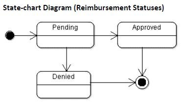
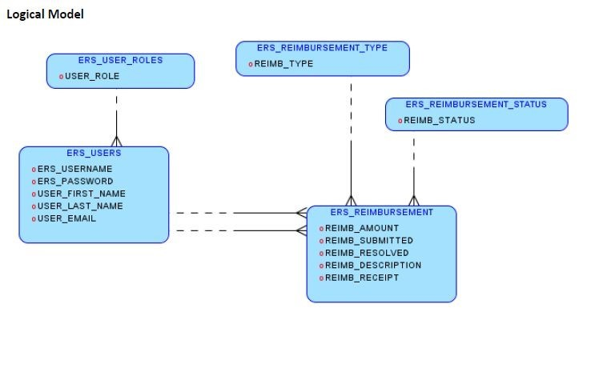
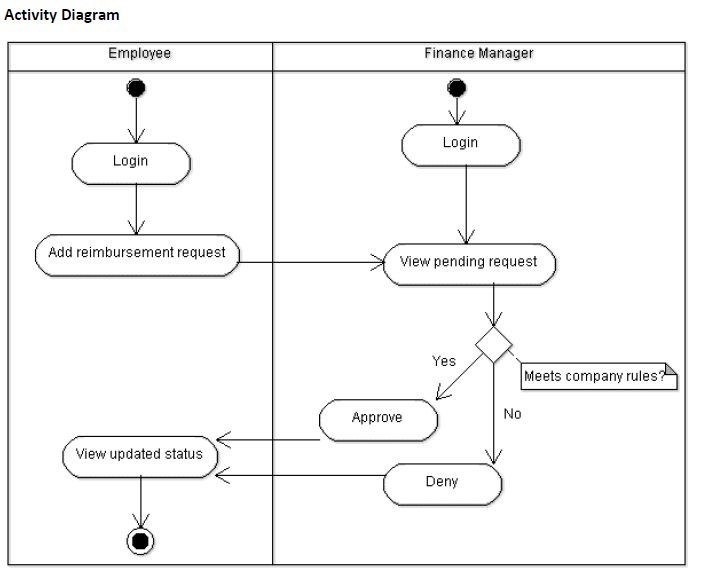

# ExpenseReimbursementSystem
The Expense Reimbursement System (ERS) will manage the process of reimbursing employees for expenses incurred while on company time. All employees in the company can login and submit requests for reimbursement and view their past tickets and pending requests. Finance managers can log in and view all reimbursement requests and past history for all employees in the company. Finance managers are authorized to approve and deny requests for expense reimbursement. 

## Technical Requirements

-   The application shall employ the DAO design pattern, and properly separate your code into the appropriate layers
-   The back-end system shall use JDBC to talk to the Database
-   The application shall deploy onto a Tomcat Server
-   The middle tier shall use Servlet technology for dynamic Web application development
-   The front-end view can use JavaScript and use AJAX to call server-side components. The web pages should look presentable (try using css and bootstrap); I’d rather not see a website from 1995.
-   Use Log4J and JUnit. There should be 75% code coverage of your service methods
-   (OPTIONAL) Passwords should be encrypted in Java and securely stored in the database
-   (OPTIONAL) Users can upload a document or image of their receipt when submitting reimbursements(optional)
-   (OPTIONAL) The application will send an email to employees letting them know that they have been registered as a new user, giving them their temporary password

## User Stories

As an employee I can:

-   Login
-   Logout
-   View the employee home page
-   Submit a reimbursement request
-   View pending reimbursement requests
-   View resolved reimbursement requests
-   View my account information
-   Update account information

As a manager I can:

-   Login
-   Logout
-   View the manager home page
-   Approve/Deny pending reimbursement requests
-   View all pending requests of all employees
-   View all resolved requests of all employees
-   View reimbursement requests of a specific employee
-   View all employees

## Reimbursement Types

Employees must select the type of reimbursement as: LODGING, TRAVEL, FOOD, or OTHER.

## Database ERD Diagram

## Use case diagram

## Activity Diagram

